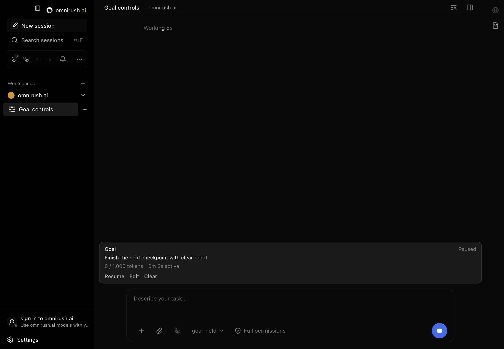

# Session goals

`/goal` saves an objective for one chat. The agent keeps working when a turn
ends until the goal is complete, paused, blocked, or reaches a limit. The goal
panel shows the objective, state, token use, and active work time.

## Use it

| Command | Result |
| --- | --- |
| `/goal Finish the release checklist` | Save an objective and start work. |
| `/goal` | Show the saved goal, or open the editor if none exists. |
| `/goal edit` | Change the objective or token limit while keeping usage. |
| `/goal pause` | Stop future turns. The current turn can finish. |
| `/goal resume` | Continue the same goal with its saved usage. |
| `/goal clear` | Remove the goal and stop future turns. |

Control words are case insensitive and apply to the whole argument. For
example, `/goal Pause the rollout after verification` is an objective.
Replacing an unfinished goal opens a confirmation. A replacement has a new
identity and starts usage at zero.

This command is in the desktop chat. The separate `omnirush-cli` app uses Pi
and needs its own goal port. These desktop changes do not add `/goal` to that CLI.



The editor accepts an optional positive whole-number token limit. Leave it
blank for no limit. The agent can finish its current provider call when the
limit is reached, so usage can exceed the limit. Resume does not reset usage.
Raise or remove the limit with Edit to continue an exhausted goal.

Plan mode holds automatic goal work. Select Build to continue an active goal.
The app's Stop control pauses the goal before interrupting the current turn.
Goals wait for current work, queued user work, permission requests, and questions.
Three empty automatic turns stop the goal with Needs help. Resume starts a fresh
three-turn audit.

## Port contract

This implements the goal contract from Codex CLI **0.159.0**, pinned to
[`687a119f0fcaace47e1f1abcc77cec6c813fd6da`](https://github.com/openai/codex/tree/687a119f0fcaace47e1f1abcc77cec6c813fd6da).
The source anchors are the [slash command handler](https://github.com/openai/codex/blob/687a119f0fcaace47e1f1abcc77cec6c813fd6da/codex-rs/tui/src/chatwidget/slash_dispatch.rs),
[goal runtime](https://github.com/openai/codex/blob/687a119f0fcaace47e1f1abcc77cec6c813fd6da/codex-rs/ext/goal/src/runtime.rs),
[accounting](https://github.com/openai/codex/blob/687a119f0fcaace47e1f1abcc77cec6c813fd6da/codex-rs/ext/goal/src/accounting.rs),
and [tool specifications](https://github.com/openai/codex/blob/687a119f0fcaace47e1f1abcc77cec6c813fd6da/codex-rs/ext/goal/src/spec.rs).

OmniRush runs OpenCode. A server-owned runner stores goals in the workspace
runtime database and admits continuation at an idle boundary. Its OpenCode
plugin exposes `create_goal`, `get_goal`, and `update_goal` for both engine
versions. A child agent completes its assigned task and cannot change its
parent's goal. Its token use counts toward the parent goal.

The shared states are `active`, `paused`, `blocked`, `usage_limited`,
`budget_limited`, and `complete`. Only the user can resume or change limits.
The tools describe the same explicit-request, completion, and blocked-audit
rules as the pinned source. A tool cannot replace an unfinished goal.

OpenCode stores uncached input, cache writes, visible output, and reasoning
separately. The runner adds those fields once per completed provider step and
excludes cache reads. It does not charge the provider reply that created a goal
through `create_goal`. Goal and turn identities keep delayed old events from
changing or charging a replacement. New Plan turns and new turns after a goal
stops do not spend its budget.

The public goal routes use the app's session ownership and write rules. Engine
callbacks require an engine policy token. Continuation passes through the
existing prompt and account policy checks.

## Verify

```sh
OMNIRUSH_EVAL_ENGINE=v2 pnpm evals:pr specs/session-goals.test.ts
OMNIRUSH_EVAL_ENGINE=v2 pnpm evals:e2e session-goals
```

The server journey uses a real managed engine and a test provider with known
usage. It covers file work across turns, exact token accounting, limits, pause,
Stop, restart, Plan-to-Build selection, replacement during work, empty-turn
recovery, and all three goal tools. The desktop journey checks the slash menu,
busy controls, reload, editor, replacement confirmation, chat isolation,
completion, and a visible token-limit stop.

See [verification](./verification.md) for saved results and commands.
