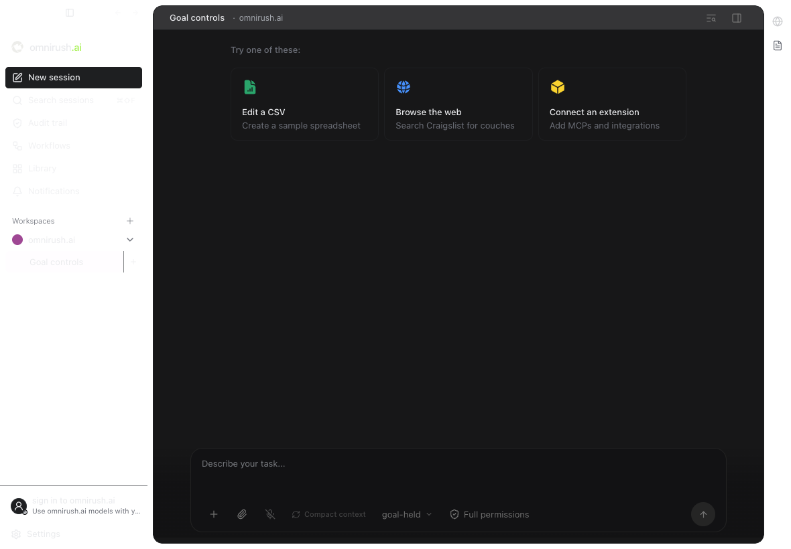
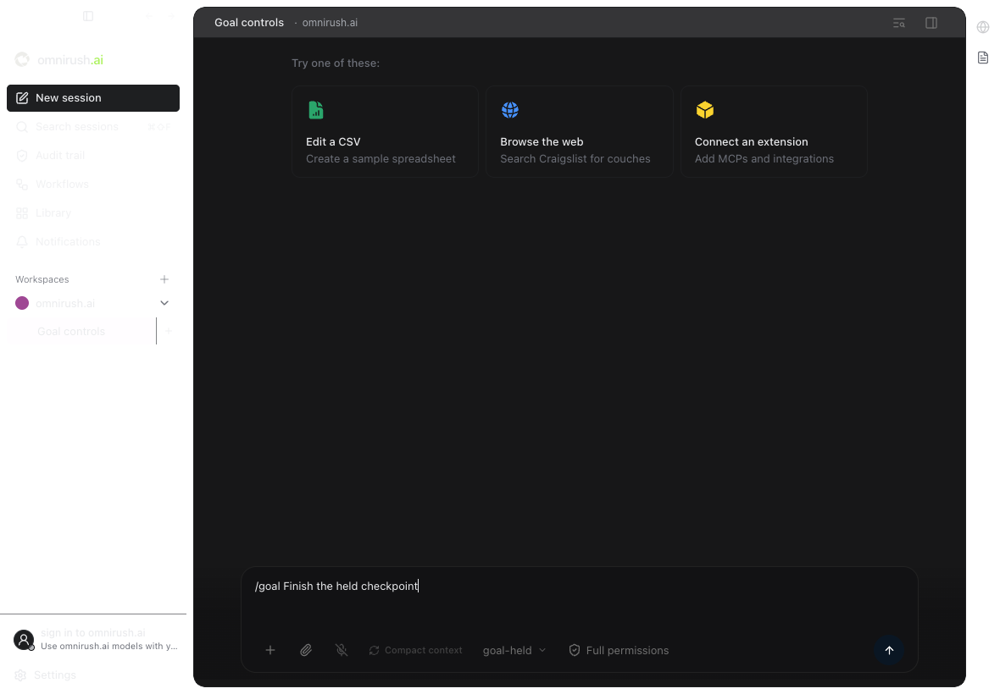
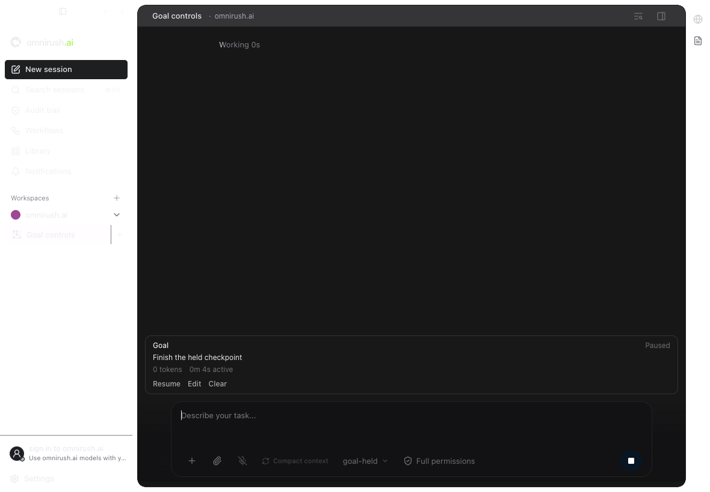
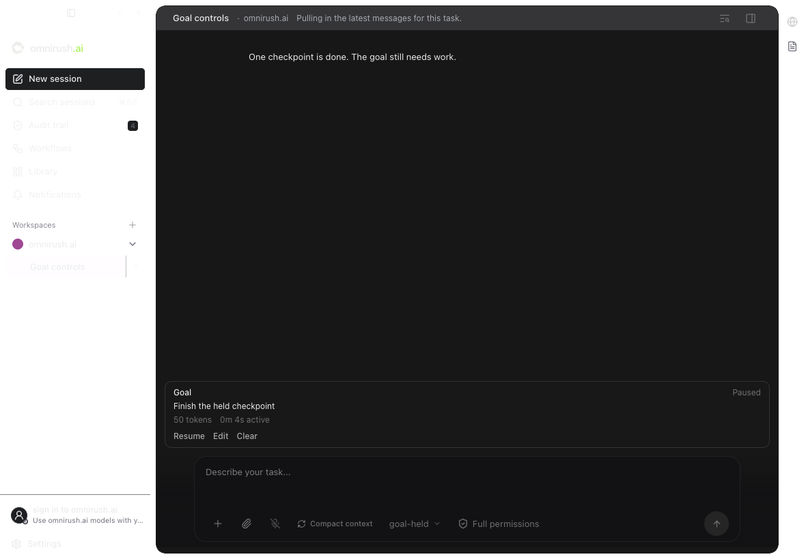

# Goal journey evidence

Tested source commit: [`a747784`](https://github.com/omnirush-ai/omnirush-gui/commit/a7477840d22aad6d691cfa90099410486f79ef3c). These records are stored on a separate proof branch. They do not change the PR code.

**Failed: 2 of 3 journeys passed.** The native desktop test starts a goal, pauses a held turn, lets it finish, and saves its 50-token usage. After reload, the paused panel appears, but typing `/goal edit` does not retain the text. Edit, replacement, chat isolation, resume, clear, and the token-limit screen remain unverified in this final native run.

| Journey | Result | Completed steps | Original record |
| --- | --- | --- | --- |
| Managed OpenCode v2 | passed | 12/12 | [test-run.json](./managed-v2/test-run.json) |
| Managed OpenCode v1 | passed | 12/12 | [test-run.json](./managed-v1/test-run.json) |
| Native desktop beta 19086 | failed | 1/2 | [test-run.json](./native-desktop/test-run.json) |

Screenshots are reference images. No visual judgment is claimed. The assertions and source records decide the test results.

## Source checks

App and server type checks and the server build passed on the same product source before the final test-fixture commits. Focused server checks passed 28 tests. The app selection passed 105 tests and failed two archive error-text expectations. Those same two failures reproduce on current main `7c33082`. The goal cases passed. Targeted dependency checking passed (16 modules, 28 dependencies), and both journey specs passed their boundary check.

[App log](./app-tests.log) · [Server log](./server-tests.log) · [Main archive baseline](./main-archive-baseline.log) · [Native log](./native-desktop.log)

Windows/Linux desktop execution and the separate Pi CLI are not covered.

[Original Managed OpenCode v2 record](./managed-v2/test-run.json)

## Managed OpenCode v2 — ✅ passed

SHA a7477840d22aad6d691cfa90099410486f79ef3c · engine v2

✅ **passed** · 12 expectations passed · 0 failed · 0 pending

**steps** 1 ✅ one incomplete turn continues and the goal completes after real file work (3.5s) · 2 ✅ the token limit excludes cached input and counts reasoning once (1.5s) · 3 ✅ pause stops future turns, survives restart, and resumes without replacing the goal (3.4s) · 4 ✅ Stop pauses a goal before interrupting and other chat work still runs (0.8s) · 5 ✅ Plan turns do not spend the goal budget and Build selection enables continuation (1.3s) · 6 ✅ restart reconnects a saved active goal without creating a second goal (3.5s) · 7 ✅ late work from a replaced goal cannot spend the new goal budget (1.5s) · 8 ✅ a new user turn keeps already running work charged to the same goal (1.1s) · 9 ✅ queued input holds automatic admission until its preparation is finished (2.0s) · 10 ✅ three empty automatic turns stop work and resume starts a fresh audit (3.1s) · 11 ✅ child work spends the parent budget without adopting the parent objective (1.1s) · 12 ✅ an explicit model request can use the three goal tools (1.5s)
**verdict** passed · 0 user observations · 0 probes · steps 12/12

### ℹ️ ASSERTION — 1. Goals continue at an idle boundary and finish with their own proof

A real managed engine wrote both checkpoint files across two turns, then called update_goal to complete. The unrelated chat has no goal.

- ✅ **PASS** Goals continue at an idle boundary and finish with their own proof — A real managed engine wrote both checkpoint files across two turns, then called update_goal to complete. The unrelated chat has no goal.

### ℹ️ ASSERTION — 2. A saved token limit uses uncached input and all output exactly once

Each real provider reply reported 130 input tokens with 100 cached, and 20 output tokens including 5 reasoning. The 60-token goal stopped after two 50-token replies at 100 used. Resume did not reset the limit or usage. Editing the limit to 120 preserved the same goal id and stopped at 150 used.

- ✅ **PASS** A saved token limit uses uncached input and all output exactly once — Each real provider reply reported 130 input tokens with 100 cached, and 20 output tokens including 5 reasoning. The 60-token goal stopped after two 50-token replies at 100 used. Resume did not reset the limit or usage. Editing the limit to 120 preserved the same goal id and stopped at 150 used.

### ℹ️ ASSERTION — 3. Pause and clear are saved controls for one chat

Pause took effect while a provider reply was held. The current turn finished without another automatic request. Restart preserved the paused goal and its identity. Resume completed it with the same identity, and clear removed it. The other chat remained unchanged.

- ✅ **PASS** Pause and clear are saved controls for one chat — Pause took effect while a provider reply was held. The current turn finished without another automatic request. Restart preserved the paused goal and its identity. Resume completed it with the same identity, and clear removed it. The other chat remained unchanged.

### ℹ️ ASSERTION — 4. Stopping one goal does not restart it or stop another chat

The native abort route saved paused before forwarding Stop. After the held reply was released, the goal sent no new request. The other chat produced a normal reply and did not acquire the stopped goal.

- ✅ **PASS** Stopping one goal does not restart it or stop another chat — The native abort route saved paused before forwarding Stop. After the held reply was released, the goal sent no new request. The other chat produced a normal reply and did not acquire the stopped goal.

### ℹ️ ASSERTION — 5. Plan mode, Build selection, and request authentication are honored

Saving in Plan launched no work. An unauthenticated resume was rejected. A real manual Plan reply spent no goal tokens or work time. Selecting Build resumed the same active goal and stopped after two charged replies at the saved budget.

- ✅ **PASS** Plan mode, Build selection, and request authentication are honored — Saving in Plan launched no work. An unauthenticated resume was rejected. A real manual Plan reply spent no goal tokens or work time. Selecting Build resumed the same active goal and stopped after two charged replies at the saved budget.

### ℹ️ ASSERTION — 6. Active goal recovery uses the saved identity

The managed server restarted while the first reply was held. Reading the saved active goal reconciled engine state and admitted one continuation. The same goal completed, and the unrelated chat stayed unchanged.

- ✅ **PASS** Active goal recovery uses the saved identity — The managed server restarted while the first reply was held. Reading the saved active goal reconciled engine state and admitted one continuation. The same goal completed, and the unrelated chat stayed unchanged.

### ℹ️ ASSERTION — 7. Old turn events cannot charge a replacement goal

The old provider reply arrived after a new objective was saved. The replacement used exactly its two 50-token replies and stopped at 100, with a new identity. The old reply did not spend its budget.

- ✅ **PASS** Old turn events cannot charge a replacement goal — The old provider reply arrived after a new objective was saved. The replacement used exactly its two 50-token replies and stopped at 100, with a new identity. The old reply did not spend its budget.

### ℹ️ ASSERTION — 8. Same-goal user input preserves earlier token use

A new user prompt arrived while the first goal reply was held. Both replies counted toward the same saved goal, so its 60-token limit stopped at 100 after two requests.

- ✅ **PASS** Same-goal user input preserves earlier token use — A new user prompt arrived while the first goal reply was held. Both replies counted toward the same saved goal, so its 60-token limit stopped at 100 after two requests.

### ℹ️ ASSERTION — 9. Queued input has a server-visible admission hold

A hold was registered before saving the goal. Across four observations spanning the continuation timer, the goal stayed active at zero tokens with no provider calls. Releasing the hold admitted work and preserved the saved goal identity and limit.

- ✅ **PASS** Queued input has a server-visible admission hold — A hold was registered before saving the goal. Across four observations spanning the continuation timer, the goal stayed active at zero tokens with no provider calls. Releasing the hold admitted work and preserved the saved goal identity and limit.

### ℹ️ ASSERTION — 10. Empty continuations stop after three turns

Three real empty replies stopped automatic work. Explicit resume retained the saved goal and allowed a fresh three-turn audit before stopping again.

- ✅ **PASS** Empty continuations stop after three turns — Three real empty replies stopped automatic work. Explicit resume retained the saved goal and allowed a fresh three-turn audit before stopping again.

### ℹ️ ASSERTION — 11. Child work belongs to its parent goal budget

A real engine child read no inherited goal and wrote its assigned file. Its three provider replies and the parent&#39;s three replies counted once, for 300 tokens. The child and unrelated chat had no saved goal.

- ✅ **PASS** Child work belongs to its parent goal budget — A real engine child read no inherited goal and wrote its assigned file. Its three provider replies and the parent&#39;s three replies counted once, for 300 tokens. The child and unrelated chat had no saved goal.

### ℹ️ ASSERTION — 12. Goal tools work through the real agent engine

On an explicit user request the engine executed create_goal with a 500-token limit, get_goal, and update_goal complete. Only the three replies after goal creation were charged, for 150 tokens. The stored result matches the requested objective, and the unrelated chat stayed unchanged.

- ✅ **PASS** Goal tools work through the real agent engine — On an explicit user request the engine executed create_goal with a 500-token limit, get_goal, and update_goal complete. Only the three replies after goal creation were charged, for 150 tokens. The stored result matches the requested objective, and the unrelated chat stayed unchanged.

---
_Test run created 2026-09-30T20:13:02.751Z · Source: `managed-v2/test-run.json` · Repro: `OMNIRUSH_EVAL_ENGINE=v2 pnpm evals:pr specs/session-goals.test.ts`_

[Original Managed OpenCode v1 record](./managed-v1/test-run.json)

## Managed OpenCode v1 — ✅ passed

SHA a7477840d22aad6d691cfa90099410486f79ef3c · engine v1

✅ **passed** · 12 expectations passed · 0 failed · 0 pending

**steps** 1 ✅ one incomplete turn continues and the goal completes after real file work (3.4s) · 2 ✅ the token limit excludes cached input and counts reasoning once (1.6s) · 3 ✅ pause stops future turns, survives restart, and resumes without replacing the goal (5.4s) · 4 ✅ Stop pauses a goal before interrupting and other chat work still runs (1.2s) · 5 ✅ Plan turns do not spend the goal budget and Build selection enables continuation (1.2s) · 6 ✅ restart reconnects a saved active goal without creating a second goal (4.5s) · 7 ✅ late work from a replaced goal cannot spend the new goal budget (1.6s) · 8 ✅ a new user turn keeps already running work charged to the same goal (1.1s) · 9 ✅ queued input holds automatic admission until its preparation is finished (2.0s) · 10 ✅ three empty automatic turns stop work and resume starts a fresh audit (4.1s) · 11 ✅ child work spends the parent budget without adopting the parent objective (1.1s) · 12 ✅ an explicit model request can use the three goal tools (1.3s)
**verdict** passed · 0 user observations · 0 probes · steps 12/12

### ℹ️ ASSERTION — 1. Goals continue at an idle boundary and finish with their own proof

A real managed engine wrote both checkpoint files across two turns, then called update_goal to complete. The unrelated chat has no goal.

- ✅ **PASS** Goals continue at an idle boundary and finish with their own proof — A real managed engine wrote both checkpoint files across two turns, then called update_goal to complete. The unrelated chat has no goal.

### ℹ️ ASSERTION — 2. A saved token limit uses uncached input and all output exactly once

Each real provider reply reported 130 input tokens with 100 cached, and 20 output tokens including 5 reasoning. The 60-token goal stopped after two 50-token replies at 100 used. Resume did not reset the limit or usage. Editing the limit to 120 preserved the same goal id and stopped at 150 used.

- ✅ **PASS** A saved token limit uses uncached input and all output exactly once — Each real provider reply reported 130 input tokens with 100 cached, and 20 output tokens including 5 reasoning. The 60-token goal stopped after two 50-token replies at 100 used. Resume did not reset the limit or usage. Editing the limit to 120 preserved the same goal id and stopped at 150 used.

### ℹ️ ASSERTION — 3. Pause and clear are saved controls for one chat

Pause took effect while a provider reply was held. The current turn finished without another automatic request. Restart preserved the paused goal and its identity. Resume completed it with the same identity, and clear removed it. The other chat remained unchanged.

- ✅ **PASS** Pause and clear are saved controls for one chat — Pause took effect while a provider reply was held. The current turn finished without another automatic request. Restart preserved the paused goal and its identity. Resume completed it with the same identity, and clear removed it. The other chat remained unchanged.

### ℹ️ ASSERTION — 4. Stopping one goal does not restart it or stop another chat

The native abort route saved paused before forwarding Stop. After the held reply was released, the goal sent no new request. The other chat produced a normal reply and did not acquire the stopped goal.

- ✅ **PASS** Stopping one goal does not restart it or stop another chat — The native abort route saved paused before forwarding Stop. After the held reply was released, the goal sent no new request. The other chat produced a normal reply and did not acquire the stopped goal.

### ℹ️ ASSERTION — 5. Plan mode, Build selection, and request authentication are honored

Saving in Plan launched no work. An unauthenticated resume was rejected. A real manual Plan reply spent no goal tokens or work time. Selecting Build resumed the same active goal and stopped after two charged replies at the saved budget.

- ✅ **PASS** Plan mode, Build selection, and request authentication are honored — Saving in Plan launched no work. An unauthenticated resume was rejected. A real manual Plan reply spent no goal tokens or work time. Selecting Build resumed the same active goal and stopped after two charged replies at the saved budget.

### ℹ️ ASSERTION — 6. Active goal recovery uses the saved identity

The managed server restarted while the first reply was held. Reading the saved active goal reconciled engine state and admitted one continuation. The same goal completed, and the unrelated chat stayed unchanged.

- ✅ **PASS** Active goal recovery uses the saved identity — The managed server restarted while the first reply was held. Reading the saved active goal reconciled engine state and admitted one continuation. The same goal completed, and the unrelated chat stayed unchanged.

### ℹ️ ASSERTION — 7. Old turn events cannot charge a replacement goal

The old provider reply arrived after a new objective was saved. The replacement used exactly its two 50-token replies and stopped at 100, with a new identity. The old reply did not spend its budget.

- ✅ **PASS** Old turn events cannot charge a replacement goal — The old provider reply arrived after a new objective was saved. The replacement used exactly its two 50-token replies and stopped at 100, with a new identity. The old reply did not spend its budget.

### ℹ️ ASSERTION — 8. Same-goal user input preserves earlier token use

A new user prompt arrived while the first goal reply was held. Both replies counted toward the same saved goal, so its 60-token limit stopped at 100 after two requests.

- ✅ **PASS** Same-goal user input preserves earlier token use — A new user prompt arrived while the first goal reply was held. Both replies counted toward the same saved goal, so its 60-token limit stopped at 100 after two requests.

### ℹ️ ASSERTION — 9. Queued input has a server-visible admission hold

A hold was registered before saving the goal. Across four observations spanning the continuation timer, the goal stayed active at zero tokens with no provider calls. Releasing the hold admitted work and preserved the saved goal identity and limit.

- ✅ **PASS** Queued input has a server-visible admission hold — A hold was registered before saving the goal. Across four observations spanning the continuation timer, the goal stayed active at zero tokens with no provider calls. Releasing the hold admitted work and preserved the saved goal identity and limit.

### ℹ️ ASSERTION — 10. Empty continuations stop after three turns

Three real empty replies stopped automatic work. Explicit resume retained the saved goal and allowed a fresh three-turn audit before stopping again.

- ✅ **PASS** Empty continuations stop after three turns — Three real empty replies stopped automatic work. Explicit resume retained the saved goal and allowed a fresh three-turn audit before stopping again.

### ℹ️ ASSERTION — 11. Child work belongs to its parent goal budget

A real engine child read no inherited goal and wrote its assigned file. Its three provider replies and the parent&#39;s three replies counted once, for 300 tokens. The child and unrelated chat had no saved goal.

- ✅ **PASS** Child work belongs to its parent goal budget — A real engine child read no inherited goal and wrote its assigned file. Its three provider replies and the parent&#39;s three replies counted once, for 300 tokens. The child and unrelated chat had no saved goal.

### ℹ️ ASSERTION — 12. Goal tools work through the real agent engine

On an explicit user request the engine executed create_goal with a 500-token limit, get_goal, and update_goal complete. Only the three replies after goal creation were charged, for 150 tokens. The stored result matches the requested objective, and the unrelated chat stayed unchanged.

- ✅ **PASS** Goal tools work through the real agent engine — On an explicit user request the engine executed create_goal with a 500-token limit, get_goal, and update_goal complete. Only the three replies after goal creation were charged, for 150 tokens. The stored result matches the requested objective, and the unrelated chat stayed unchanged.

---
_Test run created 2026-09-30T20:14:51.987Z · Source: `managed-v1/test-run.json` · Repro: `OMNIRUSH_OPENCODE_BIN=&lt;managed-v1-binary&gt; pnpm evals:pr specs/session-goals.test.ts`_

[Original Native desktop beta 19086 record](./native-desktop/test-run.json)

## Native desktop beta 19086 — ❌ failed

SHA a7477840d22aad6d691cfa90099410486f79ef3c · engine v2

❌ **0/4 screenshots passed · 1 assertion** · 1 expectations passed · 0 failed · 0 pending

**[world]** desktop(local) · workspace(/tmp/omnirush-session-goals-ui-1790798992593) · [seed:raw] evalIn(<callback>) ×3 · session("Goal controls")
**[user]** screenshot · type(composer, "/go", replace) · see(text=Set a goal and keep working until it is complete.) · type(composer, "/goal Finish the held checkpoint", replace) · press(Enter) · screenshot
**[probe]** desktopApi(GET /workspace/ws_a8780817e791/session-goals/ses_f0c0fe48bffeDxZNqe9YLplznE) · eventually(goal API and visible panel reach active)
**[user]** see(testId=session-goal)
**[probe:raw]** [probe:raw] eval(<callback>)
**[probe]** eventually(visible goal status is active)
**[user]** notSee(text=/Continue working toward the active session goal/) · see(testId=goal-objective)
**[probe]** eventually(real provider turn is held)
**[user]** type(composer, "/goal PAUSE", replace) · press(Enter)
**[probe]** desktopApi(GET /workspace/ws_a8780817e791/session-goals/ses_f0c0fe48bffeDxZNqe9YLplznE) · eventually(goal API and visible panel reach paused)
**[user]** see(testId=session-goal)
**[probe:raw]** [probe:raw] eval(<callback>)
**[probe]** eventually(visible goal status is paused)
**[user]** screenshot · see(text=One checkpoint is done. The goal still needs work., timeoutMs=30000)
**[probe]** desktopApi(GET /workspace/ws_a8780817e791/session-goals/ses_f0c0fe48bffeDxZNqe9YLplznE) · eventually(the current reply finishes and is charged while future goal turns stay paused) · desktopApi(GET /workspace/ws_a8780817e791/session-goals/ses_f0c0fe48bffeDxZNqe9YLplznE)
**[user]** reload
**[probe]** desktopApi(GET /workspace/ws_a8780817e791/session-goals/ses_f0c0fe48bffeDxZNqe9YLplznE) · eventually(goal API and visible panel reach paused)
**[user]** see(testId=session-goal)
**[probe:raw]** [probe:raw] eval(<callback>)
**[probe]** eventually(visible goal status is paused)
**[user]** notSee(text=/Continue working toward the active session goal/)
**[probe]** desktopApi(GET /workspace/ws_a8780817e791/session-goals/ses_f0c0fe48bffeDxZNqe9YLplznE)
**[user]** ❌ type(composer, "/goal edit", replace) · screenshot
**steps** 1 ✅ the built-in slash menu starts a goal and busy Enter can pause it (5.3s) · 2 ❌ reload and edit preserve the goal identity and usage (14.8s)
**verdict** failed · 12 user observations (screenshot ×4, see ×6, notSee ×2) · 17 probes · steps 1/2

### ℹ️ ASSERTION — 1. The slash goal control bypasses the busy chat queue

The built-in menu exposed goal, the real provider was held during an active turn, and Enter on /goal PAUSE immediately saved paused. The current reply then finished and charged 50 tokens without another model request.

- ✅ **PASS** The slash goal control bypasses the busy chat queue — The built-in menu exposed goal, the real provider was held during an active turn, and Enter on /goal PAUSE immediately saved paused. The current reply then finished and charged 50 tokens without another model request.

### ⚪ UNVALIDATED — 2. slash goals remain visible after reload and their controls work while a chat is busy artifact 1

- ⚪ **UNVALIDATED** — no visual expectations recorded.

### ⚪ UNVALIDATED — 3. slash goals remain visible after reload and their controls work while a chat is busy artifact 2

- ⚪ **UNVALIDATED** — no visual expectations recorded.

### ⚪ UNVALIDATED — 4. slash goals remain visible after reload and their controls work while a chat is busy artifact 3

- ⚪ **UNVALIDATED** — no visual expectations recorded.

### ⚪ UNVALIDATED — 5. slash goals remain visible after reload and their controls work while a chat is busy artifact 5

- ⚪ **UNVALIDATED** — no visual expectations recorded.

---
_Test run created 2026-09-30T20:09:41.169Z · Source: `native-desktop/test-run.json` · Repro: `OMNIRUSH_EVAL_ENGINE=v2 OMNIRUSH_OPENCODE2_BIN=&lt;native-beta-19086-binary&gt; pnpm evals:e2e session-goals`_
